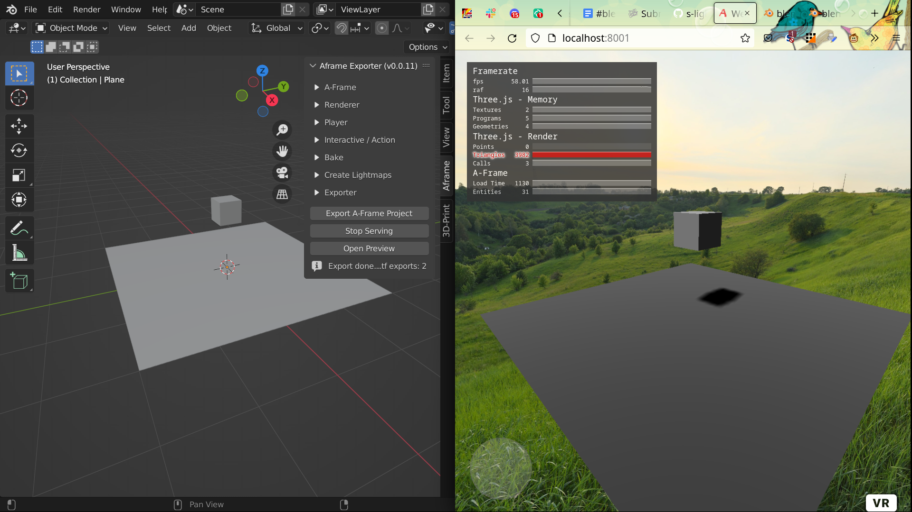

# Blender & Web: creative worlds ;-)
<!--lint disable list-item-indent-->
<!--lint disable list-item-bullet-indent-->

created for [*Blender 3D Summer School*](https://blender3dschool.de/)

## Beschreibung
Lust eine Blender-Scene interaktive als Website zu veröffentlichen?
Doch noch keine Idee wie das geht?
Wir werden eine vorgefertigte Blender-Scene als 'A-Frame'-Projekt exportieren und
anhand dieser die verschiedenen Möglichkeiten erkunden.

## Topics
- wie ist eine A-Frame Scene aufgebaut
- Exporter
    - Funktionsweise: was macht der Exporter eigentlich?
    - Optionen kennenlernen
- interaktive Elemente
- eventuell: erweiterte anpassungsmöglichkeiten (= eigene Javascript Programmierung)

## Grundlagen
- grundlegende Bedienung von Blender
- von Vorteil: Kenntnisse von HTML & JS

## Vorbereitungen
Bitte schon folgende Software vor Start des Workshops Installieren und einmal testen das sie Startet:
- die [aktuelle Blender-Version 3.2.1](https://www.blender.org/download/)
- Web-Browser [Firefox](https://www.mozilla.org/en-US/firefox/new)
    (so das wir alle eine identische Grundlage haben)

Gerne auch schon mal das Blender A-Frame Exporter Addon installieren -
(wir verwenden eine von mir modifizierte/erweiterten Version)
- [Download](https://github.com/s-light/aframe_blender_exporter/archive/refs/heads/dev_rebase.zip)
- Blender Öffnen
- `Edit -> Preferences -> Add-ons -> Install`
- Navigiere zu dem ZIP-File

Alternative kannst du natürlich auch gern das [repository](https://github.com/s-light/aframe_blender_exporter/tree/dev_rebase) in dein Blender-Addon-Verzeichnis Klonen..
wichtig ist hier dann in den `dev_rebase` branch zu wechseln.

## Ablauf
- exporter addon installieren
- Default Cube → erster export
    - *Inspektor* im Browser kennen lernen
    - ein blick in die *Browser Development Tools*
    - export Ordner Struktur
- Beispiel Scene erkunden

wenn noch zeit ist
- interaktive Elemente einfügen (point & click)
- interaktion scene → website
- animationen abspielen

## exporter quick list
Kurzübersicht über die Einstellungsmöglichkeiten des Exporters und deren Bedeutung
TODO...
